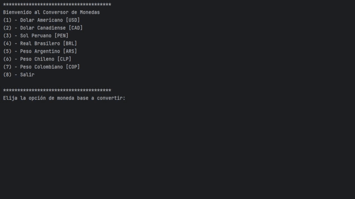

---
# Conversor de Monedas

---

Este proyecto es un **Conversor de Monedas** interactivo desarrollado en Java. Permite convertir entre diferentes tipos de monedas internacionales y proporciona una interfaz en consola para una experiencia de usuario fluida y sencilla. Este proyecto se realizo con Alura Latam.

---

## 🚀 Funcionalidades

1. **Selección de moneda base y moneda objetivo:**
   - Consulta de tasas de cambio actualizadas en tiempo real a través de una API.

2. **Conversión dinámica:**
   - Al ingresar el monto a convertir, el programa calcula y muestra el resultado basado en las tasas de conversión disponibles.

3. **Interfaz en consola:**
   - Se presenta un menú claro y sencillo, guiando al usuario paso a paso.

4. **Opciones de monedas soportadas:**
   - Dólar Americano (USD)
   - Dólar Canadiense (CAD)
   - Sol Peruano (PEN)
   - Real Brasileño (BRL)
   - Peso Argentino (ARS)
   - Peso Chileno (CLP)
   - Peso Colombiano (COP)

---

## 🛠 Tecnologías Utilizadas
- Java 17
- API de Exchange Rate
- IntelliJ IDEA (entorno de desarrollo)
- Git (control de versiones)
- Trello (organización de tareas)

---
## ✨ Conclusiones
- Este proyecto es una introducción práctica a la programación en Java y el uso de estructuras fundamentales como switch, bucles y validaciones.
- Refuerza la capacidad de implementar interacciones simples en la consola y trabajar con entradas del usuario.
- Amplía las posibilidades de entender conceptos como lógica condicional y estructuración de código.

---

## 💻 Demostración

---

